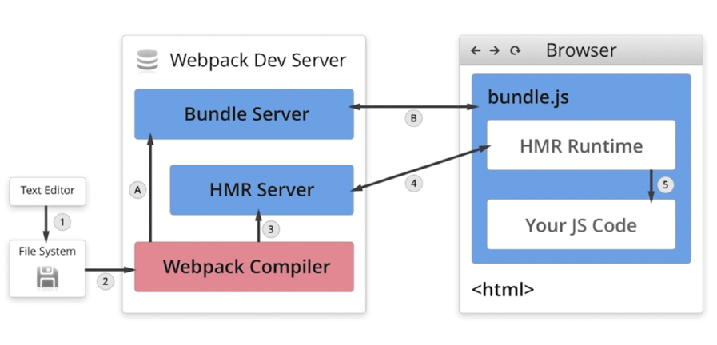

### 解析es6
- 使用babel-loader
- 配置文件.babelrc
    - presets: 多个plugins的集合
      ```text
        @babel/preset-env: js语法解析
        @babel/preset-react： react语法解析
      ```
    - plugins：一个plugin对应一个功能
    
### 解析css
- 使用css-loader：用于加载.css文件，并且转换成commonjs对象
- style-loader: 将样式用过<style>标签插入到head中
- less-loader: 用于将less转换成css

### 解析图片/字体
- 使用file-loader
- 使用url-loader,可以设置较小资源自动base64

### 文件监听
- 文件监听是发现源码发生变化时，自动重新构建出新的输出文件
- 开启监听模式的两种方式（缺点：每次需要手动刷新浏览器）：
    - 启动webpack命令时，带上--watch参数
    - 在配置webpack.config.js中，设置watch:true
- 文件监听的原理
    ```javascript
        // 轮询判断文件的最后编辑时间是否变化，
        // 若某个文件发生了变化，并不会立刻告诉监听者，而是先缓存起来，等aggregateTimeout
       module.exports = {
          // 默认false，也就是不开启
          watch: true,
          // 只有开启监听模式，watchOptions才有意义
          watchOptions: {
            // 默认为空。不监听的文件或者文件夹
            ignored: /node_modules/,
            // 监听到变化发生后会等300ms再去执行，默认300ms
            aggregateTimeout: 300,
            // 判断文件是否发生变化是通过不停询问系统指定文件有没有变化实现的，默认每秒问1000次
            poll: 1000
          }
      }
    ```

### 热更新：
- 上述文件监听的缺点比较明显，每次更新都要手动刷新浏览器

#### webpack-dev-server
- wds不需要手动刷新浏览器
- wds不输出文件，而是放在内存中
- 使用HotModuleReplacementPlugin插件实现
```javascript
// package.json
// 需要注意的是，如果webpack、webpack-cli、webpack-dev-server版本不兼容的时候，会出现 Cannot find module 'webpack-cli/bin/config-yargs'的报错
// demo成功的版本："webpack": "^5.24.3","webpack-cli": "^3.3.12","webpack-dev-server": "^3.11.2"
{
  "dev": "webpack-dev-server --open"
}
// webpack.config.js
const webpack = require('webpack');
module.exports = {
  plugins: [
    new webpack.HotModuleReplacementPlugin()
  ],
  devServer: {
    contentBase: './dist',
    hot: true
  }
}
```

#### webpack-dev-middleware
- 也可以实现热更新
- wdm将webpack输出的文件传输给服务器，适用于灵活的定制场景，一般搭配koa、express使用

#### 热更新的原理

- webpack compile将js编译成bundle
- HMR server将热更新的文件输出给HMR runtime
- Bundle sever提供文件在浏览器的访问
- HMR runtime会被注入到浏览器，更新文件的变化
- bundle.js构建输出文件

### 文件指纹
- hash:和整个项目的构建相关，只要项目文件有修改，整个项目构建的hash值就会更改,一般设置图片文件
```javascript
  module.exports = {
    module: {
      rules: [
        {
          test: /.(png|jpg|jpeg)$/,
          use: [
            {
              loader: 'file-loader',
              options: {
                name: './img/[name].[hash:8].[ext]'
              }
            }
          ]
        }
      ]
    },
}
```
- chunkhash：和webpack打包的chunk有关，不同entry会生成不同的chunkhash值，一般设置js文件
```javascript
module.exports = {
  output: {
    path: path.join(__dirname, 'dist'),
    filename: '[name][chunkhash:8].js'
  },
}
```
- contenthash:根据内容来定义hash，文件内容不变，则contenthash不变，一般设置css文件

#### [文件占位符说明](https://webpack.js.org/configuration/output/#outputfilename)


